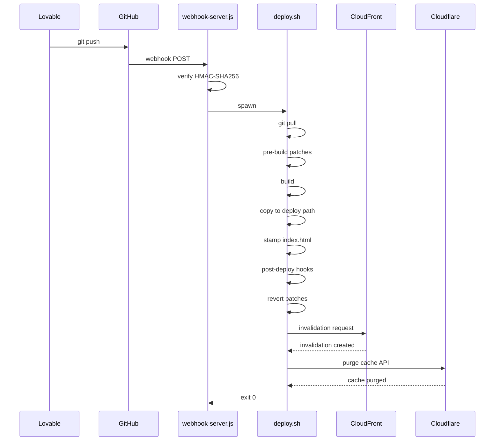

<p align="center">
  <a href="https://sharpsir.group">
    
  </a>
</p>

<h3 align="center">GitHub Watcher</h3>

<p align="center">
  Zero-dependency webhook server that auto-deploys your repos on <code>git push</code>.<br />
  No CI provider needed — just Node.js, a JSON config, and a server.
</p>

<p align="center">
  <a href="LICENSE"></a>
  = 14" />
  
  
</p>

<p align="center">
  
  
  
  
  
  
  
  
  
</p>

---

### Why

We build apps in [Lovable](https://lovable.dev), which syncs every change to a GitHub repo. GitHub Watcher bridges the gap between Lovable's cloud development and our self-hosted infrastructure: every time Lovable pushes to `main`, this server pulls the code, patches it for our subpath deployment (e.g. `/hrms/`, `/pipeline/`), builds it, and copies the output to the web server — all without touching the Lovable project files.

No GitHub Actions YAML, no build minutes to burn, no vendor lock-in. Just a single Node.js process, a JSON config, and a GitHub webhook.

### The Problem

| Scenario | GitHub Actions | GitHub Watcher |
|---|---|---|
| Build minutes | Limited free tier, then paid | Unlimited — your own CPU |
| Self-hosted deploy | Needs SSH keys, runners, or third-party actions | Built-in — deploys locally |
| Subpath SPA patching | Custom scripts in YAML | First-class `preBuild` config |
| CloudFront invalidation | Extra action + AWS credentials in secrets | Built-in, one config key |
| Cloudflare cache purge | Extra action + API token in secrets | Built-in, one config key |
| Webhook secret rotation | Update repo settings + re-deploy secrets | Edit `.secrets`, restart PM2 |
| Debugging deploys | Scroll through action logs in browser | `pm2 logs github-watcher` or `./logs/` |

### Features

- **Zero dependencies** — runs on Node.js standard library only
- **Multi-repo** — deploy any number of repositories from one instance
- **Branch filtering** — only deploy pushes to the branch you care about
- **Signature verification** — validates `X-Hub-Signature-256` using HMAC-SHA256
- **Pre-build patching** — apply find/replace patches before build, auto-reverted after
- **Post-deploy hooks** — run arbitrary commands after deployment (restart services, notify, etc.)
- **CloudFront invalidation** — optional CDN cache busting via AWS CLI
- **Cloudflare cache purge** — optional edge + Worker Cache API purge via Cloudflare API
- **Deploy queue** — concurrent pushes to the same repo are queued, not dropped
- **Deploy stamping** — injects commit hash + timestamp into `index.html` for traceability
- **Webhook reconciliation** — polls remote tips vs deploy stamps every 5 minutes so a dropped or delayed GitHub delivery cannot leave an app stale
- **Health check** — `GET /health` endpoint for uptime monitoring
- **Sync status** — `GET /status` reports per-target deployed vs remote sha
- **PM2 ready** — ships with an `ecosystem.config.js` for production process management

### Architecture



### Quick Start

#### 1. Clone

```bash
git clone https://github.com/sharpsir-group/github-watcher.git
cd github-watcher
```

#### 2. Configure

```bash
cp config.example.json config.json
```

Edit `config.json` with your repositories:

```json
{
  "maxConcurrentDeploys": 1,
  "reconcileIntervalMs": 300000,
  "repos": {
    "your-org/your-repo": {
      "name": "My App",
      "localPath": "/home/deploy/your-repo",
      "deployPath": "/var/www/my-app",
      "branch": "main",
      "preBuild": [],
      "buildCmd": "npm install --include=dev && npm run build",
      "distFolder": "dist",
      "postDeploy": [],
      "cloudfront": {},
      "secret": "WEBHOOK_SECRET_MY_APP"
    }
  }
}
```

> **Note:** Use `npm install --include=dev` instead of `npm ci` in `buildCmd`. PM2 sets `NODE_ENV=production`, which causes `npm install` / `npm ci` to skip devDependencies (including build tools like Vite). The `--include=dev` flag ensures they are always installed.

#### 3. Create `.env`

```bash
cp .env.example .env
chmod 600 .env
```

Generate a webhook secret and add it:

```bash
openssl rand -hex 32
# Paste the output as WEBHOOK_SECRET_MY_APP= in .env
```

AWS and Cloudflare credentials go in the same file (see Configuration Reference below).

#### 4. Clone your target repo

```bash
git clone git@github.com:your-org/your-repo.git /home/deploy/your-repo
```

The clone at `localPath` is required — `deploy.sh` only ever `fetch`es an existing checkout,
it never clones for you. The `deployPath` does **not** need to exist; `deploy.sh` creates it.

#### 5. Start

```bash
# Direct
node webhook-server.js

# Or with PM2 (recommended)
pm2 start ecosystem.config.js
pm2 save
```

#### 6. Add the webhook on GitHub

Go to your repository **Settings > Webhooks > Add webhook**:

| Field | Value |
|---|---|
| Payload URL | `http://your-server:9001/` |
| Content type | `application/json` |
| Secret | The `WEBHOOK_SECRET_*` value from your `.env` file |
| Events | Just the `push` event |

Or use the GitHub CLI:

```bash
gh api repos/your-org/your-repo/hooks --method POST \
  -f 'name=web' \
  -f 'config[url]=https://your-server/webhook/github-watcher' \
  -f 'config[content_type]=json' \
  -f 'config[secret]=YOUR_SECRET_VALUE' \
  -f 'config[insecure_ssl]=0' \
  -f 'events[]=push' \
  -F 'active=true'
```

### Onboarding a new app — checklist

Everything below is required. Steps 1–2 alone give you a target that **silently never deploys**.

| # | Step | Notes |
|---|---|---|
| 1 | **Clone** the repo to `localPath` | `deploy.sh` never clones; it `fetch`es an existing checkout |
| 2 | **Add the `config.json` entry** | Key `org/repo` (or `org/repo@branch`). See the field table below and the base-path patch trio |
| 3 | **Add `WEBHOOK_SECRET_<APP>` to `.env`** | `openssl rand -hex 32`; must match the `secret` field. Without it pushes deploy **unverified** |
| 4 | **Create the GitHub webhook** | Push events, `application/json`, same secret, URL `https://<host>/webhook/github-watcher` |
| 5 | **Trigger the first deploy with a real push** | The reconciler **cannot** bootstrap a new target — it skips any deploy path with no `<!-- deploy: … -->` stamp, which is every never-deployed app |
| 6 | **Register the app's SSO redirect URI** (Matrix apps) | `https://<host>/<subpath>/auth/callback`, or OAuth fails after login |
| 7 | **Verify** | `curl -s localhost:9001/status`, then the newest `logs/<org>_<repo>_*.log` for `Deployment completed successfully` |

You do **not** need to create the `deployPath`, write an `.htaccess`, or restart the process —
see below.

#### No restart needed to add a repo or secret

`config.json` and `.env` are re-read **per webhook request** (and again when the queue pumps a
deploy), so a new target, a rotated secret, or a changed `maxConcurrentDeploys` takes effect
immediately. Only the **reconciler settings** (`reconcileIntervalMs` / `reconcileEnabled`) are
read once at boot, so changing those needs `pm2 restart github-watcher --update-env`.

#### Base-path patch trio (subpath SPAs)

A subpath deploy needs all three patches, and all three must agree with
`basename(deployPath)` — see [SPA `.htaccess`](#spa-htaccess) for the failure mode:

| Patch target | Purpose |
|---|---|
| `vite.config.ts` `base` | asset URLs |
| `src/App.tsx` `<BrowserRouter basename>` | client-side routing |
| `src/lib/matrix-sso.ts` `BASE_PATH` | OAuth `redirect_uri` |

Most Matrix entries strip any committed `base:` with a regex patch first, then insert their own,
so the repo can stay root-mounted for Lovable preview.

### Configuration Reference

#### Top-level Config (`config.json`)

| Field | Type | Default | Description |
|---|---|---|---|
| `maxConcurrentDeploys` | number | `1` | How many `deploy.sh` processes may run at once |
| `reconcileIntervalMs` | number | `300000` | How often to compare live deploy stamps to remote tips (ms). Set `0` or `reconcileEnabled: false` to disable |
| `reconcileEnabled` | boolean | `true` | Set `false` to turn off the reconciler without changing the interval |
| `repos` | object | — | Map of `org/repo` or `org/repo@branch` → target config |

#### Repository Config (`config.json`)

| Field | Type | Description |
|---|---|---|
| `name` | string | Display name used in logs |
| `localPath` | string | Absolute path to the cloned repository |
| `deployPath` | string | Where built files are copied to |
| `branch` | string | Branch this target builds (must match the push; see `@branch` keys below) |
| `preBuild` | array | Find/replace patches applied before build (auto-reverted) |
| `buildCmd` | string | Shell command to build the project |
| `distFolder` | string | Build output directory (relative to repo root) |
| `postDeploy` | array | Shell commands to run after deployment |
| `cloudfront` | object | Optional CloudFront CDN invalidation config |
| `cloudflare` | object | Optional Cloudflare cache purge config |
| `secret` | string | Key name in `.env` for webhook signature verification |

#### Multi-branch targets (`org/repo@branch`)

One GitHub repository can drive multiple equal deploys. Prefer keys of the form
`org/repo@branch` (one entry per branch), each with its own `localPath`,
`deployPath`, and `preBuild` base path:

```json
"acme/app@main":  { "branch": "main",  "localPath": "…/app-main",  "deployPath": "…/htdocs/app-main",  … },
"acme/app@cdto":  { "branch": "cdto",  "localPath": "…/app-cdto",  "deployPath": "…/htdocs/app-cdto",  … }
```

Webhook lookup: `org/repo@<pushed-branch>` first, then legacy `org/repo` (single
entry with a `.branch` filter). Unmatched branches on a multi-target repo are
ignored; unknown repos still 404.

#### Pre-Build Patches

Patches let you modify source files before build without polluting your git history. They are automatically reverted after the build completes (or fails).

```json
{
  "preBuild": [
    {
      "file": "vite.config.ts",
      "find": "export default defineConfig({",
      "replace": "export default defineConfig({\n  base: \"/app/\","
    },
    {
      "file": "src/lib/matrix-sso.ts",
      "find": "const BASE_PATH = '/matrix-apps-template'",
      "replace": "const BASE_PATH = '/app'"
    }
  ]
}
```

##### Deploying SPAs to a Subpath

When deploying a Vite + React Router app to a subpath (e.g. `/app/`), three patches are typically needed:

1. **Vite `base`** — so asset URLs (JS, CSS, images) resolve correctly
2. **React Router `basename`** — so the client-side router matches routes under the subpath
3. **SSO `BASE_PATH`** — so OAuth redirect URIs point to the correct callback URL (Matrix SSO apps only)

```json
{
  "preBuild": [
    {
      "file": "vite.config.ts",
      "find": "export default defineConfig(({ mode }) => ({",
      "replace": "export default defineConfig(({ mode }) => ({\n  base: \"/app/\","
    },
    {
      "file": "src/App.tsx",
      "find": "<BrowserRouter>",
      "replace": "<BrowserRouter basename=\"/app\">"
    },
    {
      "file": "src/lib/matrix-sso.ts",
      "find": "const BASE_PATH = '/matrix-apps-template'",
      "replace": "const BASE_PATH = '/app'"
    }
  ]
}
```

Without the `basename` patch, the app will load but the router will show a 404 because it doesn't know its routes are prefixed.

Without the `BASE_PATH` patch, the app will redirect to SSO login with the wrong `redirect_uri` (e.g. `/matrix-apps-template/auth/callback` instead of `/app/auth/callback`), causing an "Invalid redirect_uri" error after authentication.

#### CloudFront Invalidation

If your deploy path is behind a CloudFront distribution, configure automatic cache invalidation:

```json
{
  "cloudfront": {
    "distributionId": "E1XXXXXXXXXX",
    "invalidationPaths": ["/*"]
  }
}
```

Requires AWS CLI installed and credentials in `.env`:

```bash
AWS_ACCESS_KEY_ID=AKIA...
AWS_SECRET_ACCESS_KEY=...
AWS_DEFAULT_REGION=us-east-1
```

#### Cloudflare Cache Purge

If your site uses a Cloudflare Worker for prerendering or caching, configure automatic cache purge after deploy:

```json
{
  "cloudflare": {
    "zoneId": "your-zone-id",
    "purgeEverything": true,
    "apiTokenKey": "CF_API_TOKEN"
  }
}
```

| Field | Type | Description |
|---|---|---|
| `zoneId` | string | Cloudflare zone ID for the domain |
| `purgeEverything` | boolean | When `true`, purges all cached content for the zone |
| `apiTokenKey` | string | Key name in `.env` whose value is the Cloudflare API token |

The API token needs **Zone > Cache Purge > Purge** permission. Add it to `.env`:

```bash
CF_API_TOKEN=your-cloudflare-api-token
```

Repos without a `cloudflare` block are unaffected — the purge step is silently skipped.

### API

| Method | Path | Description |
|---|---|---|
| `GET` | `/` or `/health` | Health check — returns `{"status":"ok"}` |
| `GET` | `/status` | Per-target sync report: deployed stamp vs remote tip, queue depth, `allInSync` |
| `POST` | `/reconcile` | Force an immediate reconcile sweep (**loopback only**) |
| `POST` | `/` | Webhook receiver — accepts GitHub push events |

```bash
# Are all apps in sync?
curl -s http://127.0.0.1:9001/status | jq '{allInSync, queueDepth, targets: [.targets[] | {key, deployed, remote, inSync}]}'

# Force a catch-up sweep (localhost only)
curl -s -X POST http://127.0.0.1:9001/reconcile
```

### Webhook reconciliation

GitHub webhooks can be delayed or dropped during platform outages. The reconciler closes that gap:

1. Every `reconcileIntervalMs` (default 5 minutes), compare each target's `<!-- deploy: … sha -->` stamp in `<deployPath>/index.html` to `git ls-remote origin <branch>`.
2. On mismatch, enqueue a deploy through the same queue used by webhooks (coalescing + `maxConcurrentDeploys` still apply — no stampede).
3. Failed deploys back off exponentially (skip 1, 2, 4… ticks, capped around 1 hour) so a broken build is not rebuilt every five minutes forever. Success clears the counter.

If a push does not deploy, check [githubstatus.com](https://www.githubstatus.com/) first. You do **not** need a synthetic webhook POST — the reconciler will pick up the drift within one interval (or immediately via `POST /reconcile` from the server).

### Deployment Pipeline

When a valid push event is received, the deploy script runs these steps in order:

1. **Git pull** — `fetch` + `reset --hard` to the configured branch
2. **Pre-build patches** — apply configured find/replace transformations
3. **Build** — run the configured build command
4. **Deploy** — `mkdir -p` the deploy path, wipe it, copy build output in
5. **Stamp** — inject deploy timestamp and commit hash into `index.html`
6. **Generate `.htaccess`** — SPA rewrite + cache headers, derived from the deploy path (see [SPA `.htaccess`](#spa-htaccess))
7. **Post-deploy hooks** — run any configured post-deploy commands (still patched at this point)
8. **Revert patches** — restore patched files to their original state
9. **CloudFront invalidation** — create CloudFront invalidation if configured
10. **Cloudflare cache purge** — purge Cloudflare edge + Worker Cache API if configured

If the build fails at any step, patches are reverted and the deploy is aborted.

### Reverse Proxy Setup

In production, place the webhook server behind a reverse proxy (Apache, Nginx) with TLS.

#### Apache

```apache
ProxyPass /webhook/github-watcher http://127.0.0.1:9001/
ProxyPassReverse /webhook/github-watcher http://127.0.0.1:9001/
```

GitHub webhook Payload URL: `https://your-domain/webhook/github-watcher`

#### SPA `.htaccess`

**`deploy.sh` writes this file for you on every deploy — do not hand-maintain it.** Any
manual edits are overwritten by the next deploy. The rewrite base is derived from the
**last path segment of `deployPath`**:

```
deployPath: /opt/bitnami/apache/htdocs/my-app   →   RewriteBase /my-app/
```

> **Invariant:** `basename(deployPath)` MUST equal the URL subpath used in the `base:`
> pre-build patch (and the router `basename` / SSO `BASE_PATH`). If `deployPath` ends in
> `my-app` but the build sets `base: "/app/"`, Apache rewrites under `/my-app/` while the
> bundle requests assets from `/app/` — the app loads a blank page with 404s on `/app/assets/*`.

The generated file is equivalent to:

```apache
<IfModule mod_rewrite.c>
    RewriteEngine On
    RewriteBase /app/
    RewriteCond %{REQUEST_FILENAME} !-f
    RewriteCond %{REQUEST_FILENAME} !-d
    RewriteRule . /app/index.html [L]
</IfModule>

<IfModule mod_headers.c>
    <FilesMatch "^index\.html$">
        Header set Cache-Control "no-cache, no-store, must-revalidate"
    </FilesMatch>
    <FilesMatch "\.(js|css|woff2)$">
        Header set Cache-Control "public, max-age=31536000, immutable"
    </FilesMatch>
</IfModule>
```

> **Note:** `deploy.sh` runs `rm -rf "$DEPLOY_PATH"/*` before copying. The `*` glob does not
> match dotfiles, so unrelated dotfiles in the deploy path survive — but `.htaccess` itself is
> regenerated from scratch each time. Anything you need to persist there must be applied by a
> `postDeploy` hook (see the `patch-share-og-htaccess.sh` targets in `config.json`).

### Running with PM2

The included `ecosystem.config.js` is ready for production use:

```bash
pm2 start ecosystem.config.js
pm2 save
pm2 startup
pm2 monit
pm2 logs github-watcher
```

### Manual Deploy

Trigger a deploy without a webhook:

```bash
./deploy.sh "your-org/your-repo"
```

### File Structure

```
github-watcher/
├── webhook-server.js      # HTTP server — receives and validates webhooks
├── deploy.sh              # Build and deploy pipeline
├── config.json            # Repository configurations (in .gitignore for fresh installs)
├── config.example.json    # Example configuration
├── ecosystem.config.js    # PM2 process manager config
├── package.json           # npm metadata and keywords
├── .env                   # All secrets and credentials (git-ignored, chmod 600)
├── .env.example           # Template for .env
├── logs/                  # Deployment logs (git-ignored)
└── README.md
```

### Security

- Webhook signatures are verified using HMAC-SHA256 (`X-Hub-Signature-256`)
- All secrets and credentials live in a single `.env` file with `600` permissions
- `.env` and `logs/` are git-ignored. `config.json` is listed in `.gitignore` too, but on an
  instance where it was committed before that rule existed it stays tracked (git ignores only
  untracked files) — check `git ls-files config.json` before assuming your edit is private.
  It holds no secret **values**, only the `secret` env-var *names* to look up in `.env`
- **A missing secret does not block a deploy.** If `config.json` names a `secret` key that is
  absent from `.env`, the server logs `Warning: No secret configured` and deploys the push
  **without verifying the signature**. Always add the `.env` value when adding a target
- Request body size is capped at 10 MB
- The server binds to `0.0.0.0` — use a firewall or reverse proxy to restrict access

### Who Is This For?

- **Lovable developers** deploying to self-hosted infrastructure
- **Indie hackers** who want CI/CD without GitHub Actions limits
- **Self-hosters** who prefer control over third-party services
- **Teams** deploying multiple Vite/React SPAs from one server

### Requirements

- **Node.js** >= 14
- **Git** (on the server)
- **PM2** (optional, recommended for production)
- **AWS CLI** (optional, only for CloudFront invalidation)

### Contributing

See [CONTRIBUTING.md](CONTRIBUTING.md) for development setup and guidelines.

### License

[MIT](LICENSE)

---

<p align="center">
  <sub>Part of the <a href="https://github.com/sharpsir-group"><strong>Sharp Matrix</strong></a> platform · <a href="https://sharpsir.group">sharpsir.group</a></sub>
</p>
